<div align="center">

# Plant Pact

### See the week a gifted plant dies. Then find out if you were right.

[](https://plant-pact.vercel.app)
[](LICENSE)
[](tsconfig.json)
[](https://nextjs.org)
[](src/lib/db)
[](https://open-meteo.com)
[](https://plant-pact.vercel.app/agent)
[](https://github.com/aniruddhaadak80/plant-pact/actions)

[Live App](https://plant-pact.vercel.app) ·
[GitHub](https://github.com/aniruddhaadak80/plant-pact) ·
[API](https://plant-pact.vercel.app/api/health) ·
[Agent](https://plant-pact.vercel.app/agent) ·
[Issues](https://github.com/aniruddhaadak80/plant-pact/issues)

Most gifted plants do not die of neglect. They die of a bad window.
**Plant Pact** takes the plant, the person, the city and the window, reads the real
14-day forecast and that city's climate normals, and tells you the odds — including
the week it is most likely to die. Then it asks you to come back on day ninety and
record what actually happened.

No account. No API key. No third-party service to sign up for. The model runs
inside the serverless function and its weights are in the repository.

</div>

---

## ✨ Features

| What you get | Why it matters |
| --- | --- |
| **A placement scored against real weather** | Drag the sill rails and the whole model re-runs against live Open-Meteo data for the recipient's city. Not a look-up table — an inference you can watch move. |
| **The week it dies** | A 14-day projection built by re-evaluating the shipped weights on the forecast prefix as it ages, plus a slope projection beyond the window. You get a date, not a shrug. |
| **The one thing that will kill it** | Ten factors grouped into light, water, air and care. Each shows the contribution it made to the logit and the sentence that justifies it, so you can disagree with it. |
| **A care card to send** | Markdown download or a standalone printable page: odds, the killer, what to change, the check-back date, and the data provenance. |
| **A pact you have to answer for** | Commit a prediction, then come back on day ninety and record the outcome. A prediction nobody checks is not a prediction. |
| **A sealed, replayable record** | Every create, update, outcome and deletion appends to a per-pact SHA-384 chain. Deleting tombstones the row and keeps the chain, so the history cannot be quietly rewritten. |
| **Nine agent tools over JSON-RPC 2.0** | The same service layer the browser uses. An agent that commits a pact and a person who commits a pact produce identical rows. |

---

## 🖼️ The product

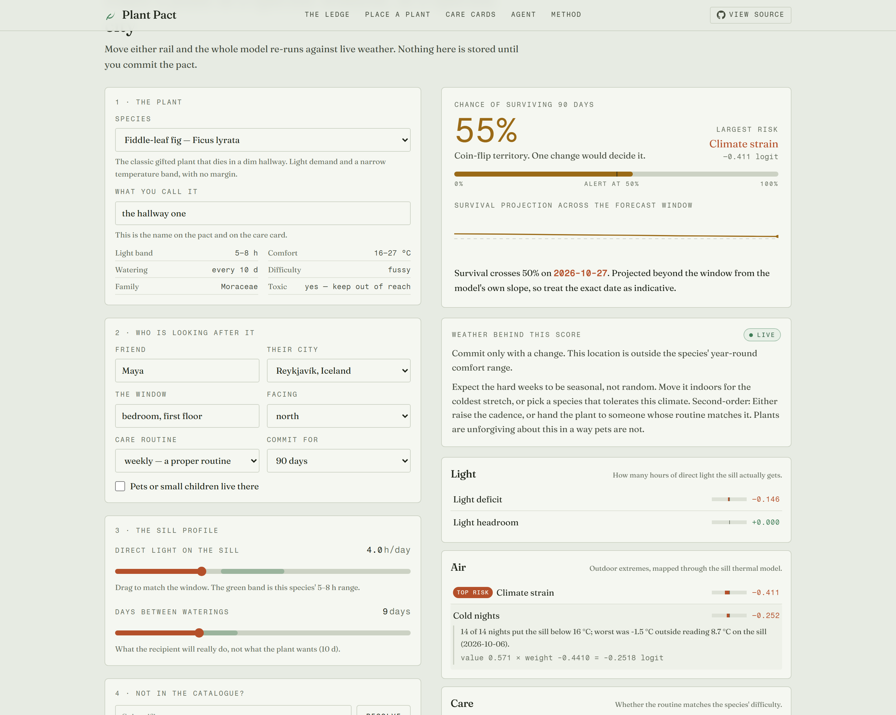

<sub>Live capture of `/advisor`. Real forecast, real inference, real failure state.</sub>

---

## 🏗️ Architecture

Six user routes, eight API routes, one service layer, two storage adapters, one
engine shared by the browser, the REST API and the agent tools.

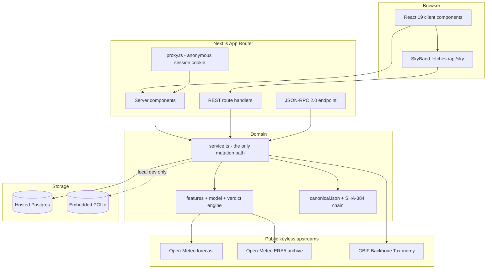

**The load-bearing decision:** there is exactly one implementation of every
mutation, in `src/lib/service.ts`. The REST handlers, the MCP tools and the
browser all call it. That is why "the agent and the UI share a path" is a fact
you can verify rather than a claim you have to trust — `npm run verify:live`
commits a pact through MCP and reads it back through REST.

---

## 🌤️ Data pipeline and offline behaviour

Two independent public upstreams, neither of which needs a key. When either fails
the app degrades to a **sealed, dated sample** and says so on the payload and on
the page. Fallback data is never written to the database and never replaces user
data.

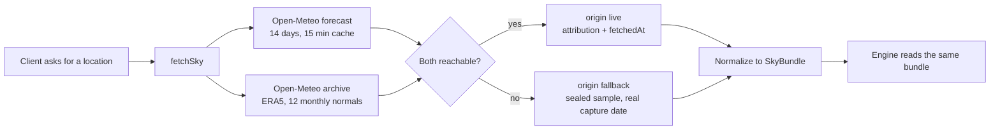

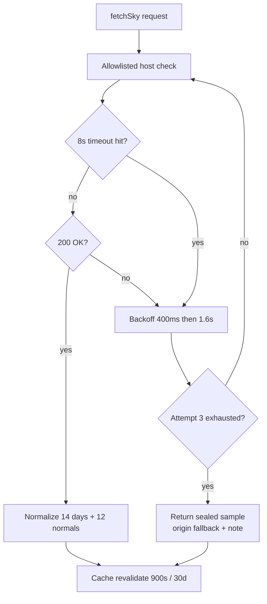

`PLANT_PACT_OFFLINE=1` short-circuits to the sealed sample with no network at
all. The test suite and local smoke runs use it so nothing depends on an external
service being up.

---

## 🧮 The deterministic engine

`p = σ(bias + Σ weightᵢ · featureᵢ)` — a logistic regression with weights
committed in `src/lib/model/weights.ts`. The sum of the per-factor
contributions equals the logit exactly, which is what the factor ledger draws.

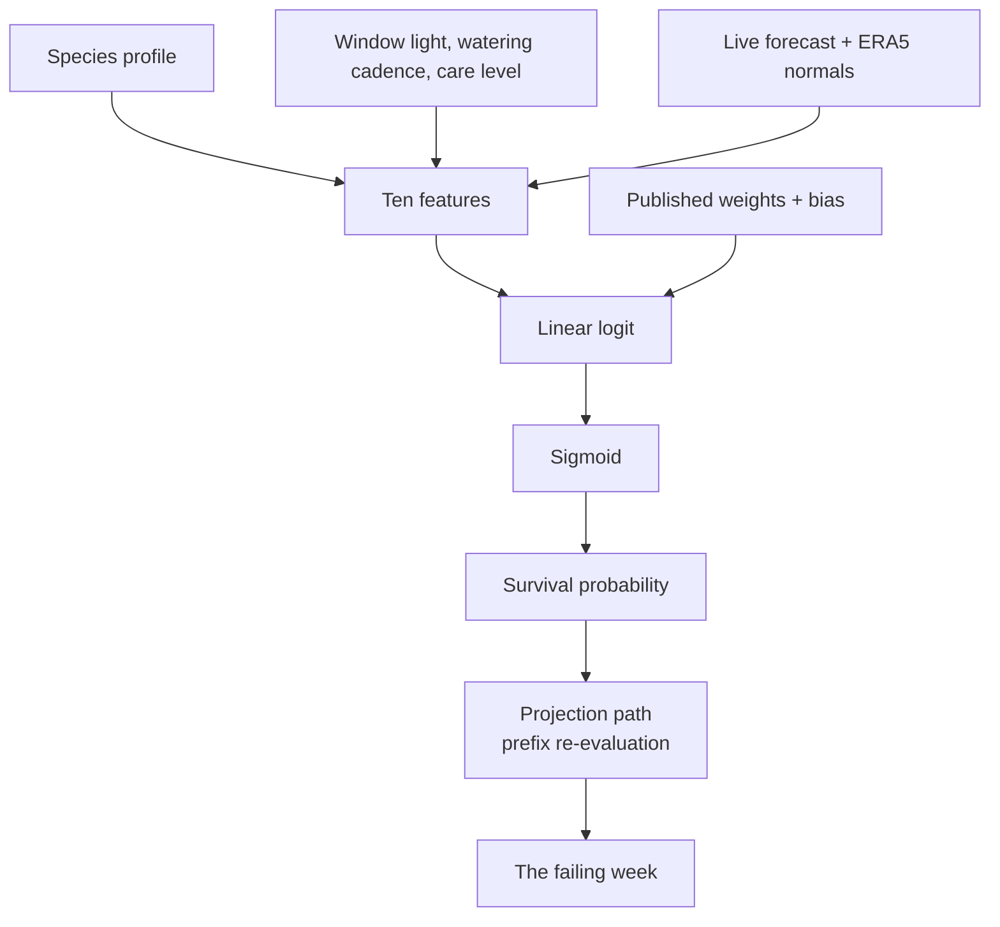

### Why these ten features

Nine are risk-shaped, where **larger always means worse**, so one negative weight
per feature is the correct hypothesis and the fit is well conditioned.
`lightHeadroom` is the only feature where more is better.

| Feature | Direction | What it reads |
| --- | --- | --- |
| `lightDeficit` | risk | How far the sill falls short of the species' minimum light. |
| `lightOvershoot` | risk | Hours past the light ceiling, which scorches rather than feeds. |
| `lightHeadroom` | good | Comfortable headroom inside the light band. |
| `coldShare` | risk | Cumulative exposure across nights the modelled sill is below tolerance. |
| `heatShare` | risk | The same for days above the ceiling. |
| `waterDry` | risk | Accumulated deficit when the routine is slower than the species wants. |
| `waterWet` | risk | The rot risk when the routine is faster. |
| `climateStrain` | risk | How much of the year sits outside tolerance, from real monthly normals. |
| `careShortfall` | risk | Gap between the stated routine and the species' difficulty. |
| `drySpell` | risk | Whether the routine leaves the forecast's dry-heat days uncovered. |

### The sill thermal model

Open-Meteo only publishes outdoor conditions, but the plant is behind glass.
Judging a plant by the raw outdoor forecast makes every temperate city look
arctic — which is both wrong and useless to the person reading the page. So
outdoor extremes are damped toward a neutral indoor temperature:

```
sillCold(outdoor) = 17 + (outdoor − 17) × 0.45
sillHeat(outdoor) = 17 + (outdoor − 17) × 0.60
```

Cold is damped harder than heat because a heated flat holds near 17–20 °C in
winter while a sunlit south sill genuinely heats up behind glass. No fitted
parameters, fully inspectable, and shown to the reader on every pact.

### How it was trained

Labels come from a **separate, hand-written risk procedure**
(`src/lib/engine/labeling.ts`): accumulate hazard from every way a placement can
fail, and call it a survival when the total stays under `1.6`. The application
never scores with that function — it scores with the trained model. Keeping them
apart is deliberate: the model can be audited against the procedure it was fitted
to instead of silently standing in for it.

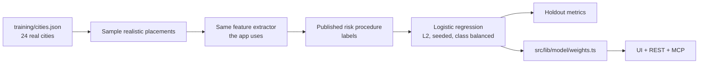

| Metric | Value |
| --- | --- |
| Corpus | 8,040 placements across 24 cities, real Open-Meteo forecasts + ERA5 normals |
| Train / holdout | 6,432 / 1,608 |
| Held-out AUC | 0.956 |
| Held-out accuracy | 0.889 |
| Base survival rate | 28.5% |

The base survival rate is the share of *randomly sampled* placements that the
labelling procedure calls a survivor. It is the honest floor for a gift, and a
good placement should read well above it. Regenerate everything with
`npm run train`; refresh the weather corpus with `npm run corpus`. CI fails if
the committed weights drift from a fresh fit.

**Read the weights honestly:** water dominates. The two watering features carry
the largest magnitudes in the model, which matches the two ways gifted plants
actually die. Heat is real but almost never the deciding factor once the sill
model is applied — its near-zero weight is an empirical finding, not an oversight.

---

## 🤖 Agent interface

Nine typed tools over JSON-RPC 2.0 at `/api/mcp`, listed in
[`public/mcp.json`](public/mcp.json) and driveable from the in-page console at
`/agent`.

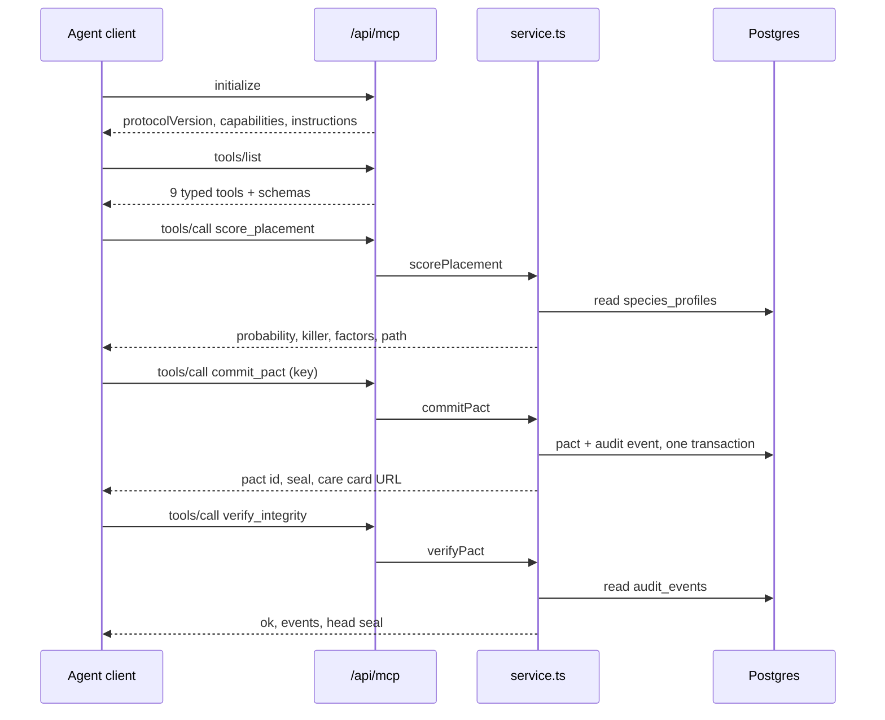

Tools are scoped to the caller's anonymous HTTP-only session cookie — the same
ownership boundary the browser uses, not a parallel world. `commit_pact` accepts
an `idempotencyKey`; a replay returns the original pact with `created=false`.
`delete_pact` tombstones rather than erases.

```bash
# Point any MCP client at the live deployment
curl -s https://plant-pact.vercel.app/api/mcp \
  -H 'content-type: application/json' \
  -d '{"jsonrpc":"2.0","id":1,"method":"tools/list"}'
```

---

## 🔐 Integrity

Every create, update, outcome and deletion appends an event to a per-pact chain.
Deletion tombstones the row and keeps every event, so a prediction cannot be
quietly erased.

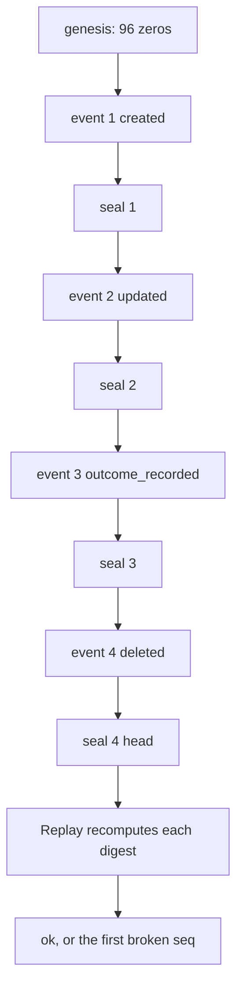

```
seal_n = SHA-384( UTF-8(prevSeal) + canonicalJson(event_n) )
```

`canonicalJson` recursively sorts object keys, preserves array order, normalises
`-0`, and drops `undefined`. Two digests are pinned as known-answer vectors in
`tests/integrity.test.ts`, so changing the wire format fails the suite rather
than silently invalidating every previously sealed pact. Replay works on
tombstoned pacts, which is how a deletion stays provable. An empty chain reports
as broken rather than vacuously valid.

---

## 🚀 Quickstart

```bash
git clone https://github.com/aniruddhaadak80/plant-pact
cd plant-pact
npm ci
npm run dev
```

Open <http://localhost:3000>. **No environment variables are required.**
Development and tests run on an embedded PGlite database (real Postgres compiled
to WebAssembly) in `./.pglite`, and the weather layer talks to the real
keyless Open-Meteo endpoints.

| Script | Does |
| --- | --- |
| `npm run dev` | Dev server |
| `npm run typecheck` | `tsc --noEmit` |
| `npm run lint` | `eslint` |
| `npm run test` | 88 unit + integration tests |
| `npm run build` | Production build |
| `npm run train` | Refit the model, rewrite `weights.ts` |
| `npm run corpus` | Refetch `training/cities.json` from Open-Meteo |
| `npm run smoke` | Playwright journey, desktop + mobile |
| `npm run verify:live` | 79 real HTTP checks against a deployment |

### Production environment variables

| Variable | Required | Purpose |
| --- | --- | --- |
| `DATABASE_URL` | **yes in production** | Hosted Postgres (Neon via the Vercel Marketplace, or any provider). Without it a production instance refuses to boot rather than accepting writes into volatile storage. |
| `DATABASE_SCHEMA` | no | Namespace the tables when sharing one database. Defaults to `public`. |
| `NEXT_PUBLIC_SITE_URL` | no | Canonical origin for metadata, sitemap and the manifest. Inferred from Vercel when unset. |
| `PLANT_PACT_OFFLINE` | no | Force the sealed weather sample with no network. Tests and offline smoke runs. |
| `PLANT_PACT_ALLOW_EMBEDDED` | no | Local smoke tests only. Lets a production *build* use PGlite. Never set this in a real deployment. |

There are **no API keys**. Open-Meteo and the GBIF Backbone Taxonomy are public,
keyless endpoints.

---

## 🔌 API

```bash
BASE=https://plant-pact.vercel.app

# Health, including a real store probe
curl -s $BASE/api/health

# Seeded catalogue with GBIF taxonomy columns
curl -s $BASE/api/species

# Resolve any name against the GBIF Backbone Taxonomy
curl -s "$BASE/api/species?q=Epipremnum%20aureum"

# Live weather, normalised, stating whether it is live or the sealed sample
curl -s "$BASE/api/sky?lat=38.7223&lon=-9.1393&place=Lisbon"

# Score without writing anything
curl -s -X POST $BASE/api/score -H 'content-type: application/json' -d '{
  "speciesSlug":"fiddle-leaf-fig","plantLabel":"the hallway one","friendName":"Maya",
  "placeLabel":"Reykjavík, Iceland","latitude":64.1466,"longitude":-21.9426,
  "windowLabel":"hallway","windowAspect":"north","windowHours":2,"wateringDays":14,
  "careLevel":"weekly","commitmentDays":90
}'
```

A mutation followed by a read-back:

```bash
# 1. Commit a pact. Idempotency-Key makes a retry safe.
PACT=$(curl -s -X POST $BASE/api/pacts \
  -H 'content-type: application/json' \
  -H "idempotency-key: demo-$RANDOM" \
  -d '{
    "speciesSlug":"golden-pothos","plantLabel":"the desk one","friendName":"Ada",
    "placeLabel":"Berlin, Germany","latitude":52.52,"longitude":13.405,
    "windowLabel":"study window","windowAspect":"east","windowHours":4.5,
    "wateringDays":9,"careLevel":"weekly","petsPresent":true,"commitmentDays":90
  }')
ID=$(echo "$PACT" | jq -r .pact.id)
echo "created $ID with seal $(echo "$PACT" | jq -r .pact.seal)"

# 2. Read it back
curl -s $BASE/api/pacts/$ID | jq '{label:.pact.plantLabel, odds:.pact.probability, replay:.replay.ok}'

# 3. Change the placement; it re-scores and appends a sealed event
curl -s -X PATCH $BASE/api/pacts/$ID -H 'content-type: application/json' \
  -d '{"windowHours":8}' | jq '.pact.probability'

# 4. Replay the seal chain
curl -s $BASE/api/pacts/$ID/verify | jq '.replay'

# 5. Close the loop
curl -s -X POST $BASE/api/pacts/$ID/outcome -H 'content-type: application/json' \
  -d '{"outcome":"survived","day":90,"note":"kept it alive"}' | jq '.pact.status'

# 6. Take the artifact
curl -s $BASE/api/pacts/$ID/card -o care-card.md

# 7. Delete: tombstoned, chain retained and still replayable
curl -s -X DELETE $BASE/api/pacts/$ID | jq '{deleted, events:.replay.events, ok:.replay.ok}'
```

Every failure returns a stable envelope with a meaningful status:

```json
{ "error": { "code": "invalid_field", "message": "windowHours must be between 0 and 24.", "details": { "field": "windowHours", "value": 99 } } }
```

---

## 📁 Project map

### User routes

| Route | Purpose | States |
| --- | --- | --- |
| `/` | Product entry: the premise, the model card at a glance, the honest limits. | Static |
| `/advisor` | **Place a plant.** Two rails that re-score against live weather on every change, then commit. | Loading, live verdict, error |
| `/pacts` | **The Ledge.** Every pact as a plant-tag rail, filtered by status in the URL, with inline delete. | Empty, loaded, error |
| `/pacts/[id]` | **A pact.** Forecast strip, odds, the failing week, full factor ledger, audit chain, care card, close-the-loop and delete. | Committed, closed, tombstoned |
| `/cards` | **Care cards.** Every card rendered from the stored record plus current weather, with Markdown preview and download. | Empty, loaded |
| `/agent` | **Agent console.** Real JSON-RPC requests and responses, one-click calls, persisted result links. | Idle, in flight, error |
| `/method` | **Method.** Model card, weights table, labelling procedure, sill model, provenance, ownership and limits. | Static |
| `/verify` | **Verify.** Replay any chain and name the first broken sequence. | Idle, clean, broken |

### API routes

| Route | Methods | Effect |
| --- | --- | --- |
| `/api/health` | `GET` | Real store probe: `SELECT 1`, seeded count, adapter, engine and model versions. |
| `/api/species` | `GET` | Catalogue, or a GBIF match for `?q=`. |
| `/api/sky` | `GET` | Normalized forecast + climate normals, labelled `live` or `fallback`. |
| `/api/score` | `POST` | Analysis, no persistence. |
| `/api/pacts` | `GET`, `POST` | List (bounded, filtered) and commit. `POST` honours `Idempotency-Key`. |
| `/api/pacts/[id]` | `GET`, `PATCH`, `DELETE` | Read, re-score on change, tombstone. |
| `/api/pacts/[id]/outcome` | `POST` | Close the loop; appends a sealed event. |
| `/api/pacts/[id]/card` | `GET` | Markdown download, or `?format=html` for the printable page. |
| `/api/pacts/[id]/verify` | `GET` | Chain replay. |
| `/api/mcp` | `POST`, `GET` | JSON-RPC 2.0 agent endpoint. |

### Key modules

| Path | Responsibility |
| --- | --- |
| `src/lib/model/features.ts` | The ten features. Single source of truth for inference **and** training. |
| `src/lib/model/weights.ts` | **Generated.** Do not hand-edit. |
| `src/lib/engine/labeling.ts` | The published risk procedure that produces training labels. |
| `src/lib/engine/verdict.ts` | Projection path, breaking point, recommendations, advice. |
| `src/lib/service.ts` | Every mutation. The only place business rules live. |
| `src/lib/db/` | Repository interface plus the Postgres and PGlite adapters over one shared SQL implementation. |
| `src/lib/integrity/chain.ts` | Canonical JSON, SHA-384 seals, replay. |
| `src/lib/weather/`, `src/lib/taxonomy/` | Upstream fetching, allowlisting, retries, sealed fallbacks. |
| `src/proxy.ts` | The anonymous session cookie, set before render. |

---

## 🔒 Security model

- **Ownership.** No accounts. An unguessable v4 UUID in an HTTP-only,
  `SameSite=Lax` cookie, established in `src/proxy.ts` before any render. Every
  query is scoped by it, so another session gets `404`, never data. Covered by
  tests.
- **Input.** Everything goes through `src/lib/validation.ts`: length caps, numeric
  ranges, enum membership. Unknown PATCH fields are rejected rather than ignored.
- **SQL.** Every query is parameterised. The only interpolated identifier is the
  schema name, and it is validated as a plain SQL identifier.
- **Output.** React escapes rendered content; there is no `dangerouslySetInnerHTML`
  anywhere. The printable card escapes every value.
- **Upstream.** Requests are restricted to `api.open-meteo.com`,
  `archive-api.open-meteo.com` and `api.gbif.org`, time-bounded at 8 seconds with
  at most three attempts.
- **Errors.** Internal messages never cross the wire; unexpected failures return a
  generic code.
- **Abuse control is best-effort, and we say so.** 20 writes per minute and 40
  pacts per session, enforced by an in-memory bucket. On Vercel each instance has
  its own memory, so a determined caller can multiply their budget across cold
  starts. This stops casual abuse, not a motivated attacker. The honest fix is a
  shared limiter behind the same interface.

Full disclosure, including known limitations, in [SECURITY.md](SECURITY.md).

---

## ⚠️ Safety and honest limits

Plant Pact gives placement guidance, **not horticultural or veterinary advice**.

- Care ranges are approximate published guidelines compiled for this project, not
  measurements of a specific cultivar.
- Toxicity flags are conservative and general. If an animal or a child chews a
  plant, confirm the species with a veterinarian or your local poison service.
- An indoor window's light hours are a number a person has to estimate. The model
  can only be as honest as that estimate, which is why every factor repeats it back.
- The projection is under the model's own assumptions, not an upstream forecast.
  The UI labels it that way.

---

## 📊 Attribution

| Source | Use | Licence |
| --- | --- | --- |
| [Open-Meteo](https://open-meteo.com/) | Daily forecast | CC BY 4.0 |
| [Open-Meteo Archive](https://open-meteo.com/en/docs/historical-weather-api) | ERA5 reanalysis climate normals | CC BY 4.0 |
| [GBIF Backbone Taxonomy](https://www.gbif.org/) | Plant taxonomy | Open |

Model weights, the sill thermal model and the risk procedure in this repository
were produced for this project. There is no third-party model API in the request
path.

---

## 🚢 Deployment

Next.js App Router on Vercel with Neon Postgres through the Vercel Marketplace
integration. The adapter selector in `src/lib/db/index.ts` refuses to start a
production build without `DATABASE_URL`, so a deployment with a broken or missing
database is visibly broken rather than quietly writing into ephemeral storage.

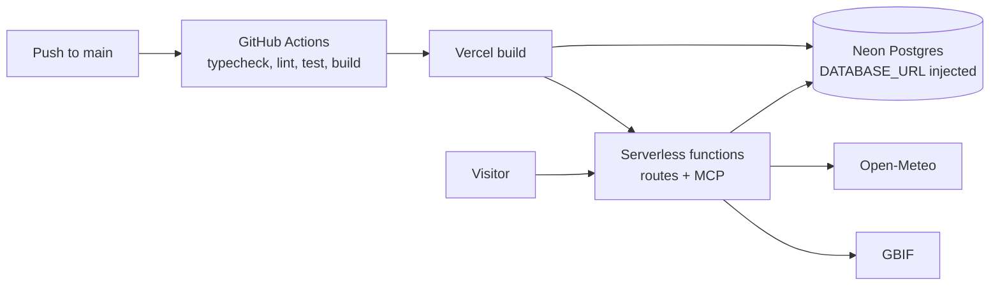

CI runs on Node 22 with `npm ci`, typecheck, lint, the 88 tests and a production
build, then refits the model and fails if the committed weights differ — so the
README cannot drift from the shipped model. A second job fails if any `.env` file
or credential-shaped file is ever tracked.

---

## 🗺️ Roadmap

### Now

Live weather, the trained model, the projection path, the sealed fallback, MCP
tools, the seal chain, care cards, and the check-back loop.

### Next

- **Placement reminders that use the model.** Today the due date is passive; a
  digest of "your five pacts are due this week, and three of them project a
  failing date before then" is the obvious next step.
- **Richer physiology.** Light-hour estimates are a single number. Real
  lux-and-orientation input would replace the single largest source of user error.
- **A shared limiter.** Swap the in-memory bucket for Upstash Redis behind the
  existing `checkRate` interface and the documented caveat goes away.

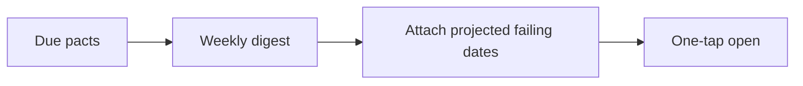

### Later

- **Outcome statistics.** Once enough pacts are recorded, publish what the model
  actually gets right and wrong. A calibration curve from real outcomes would be
  more honest than any held-out metric.
- **A corpus open to contribution.** Let people add species profiles with a
  provenance field, reviewed against a published rubric.

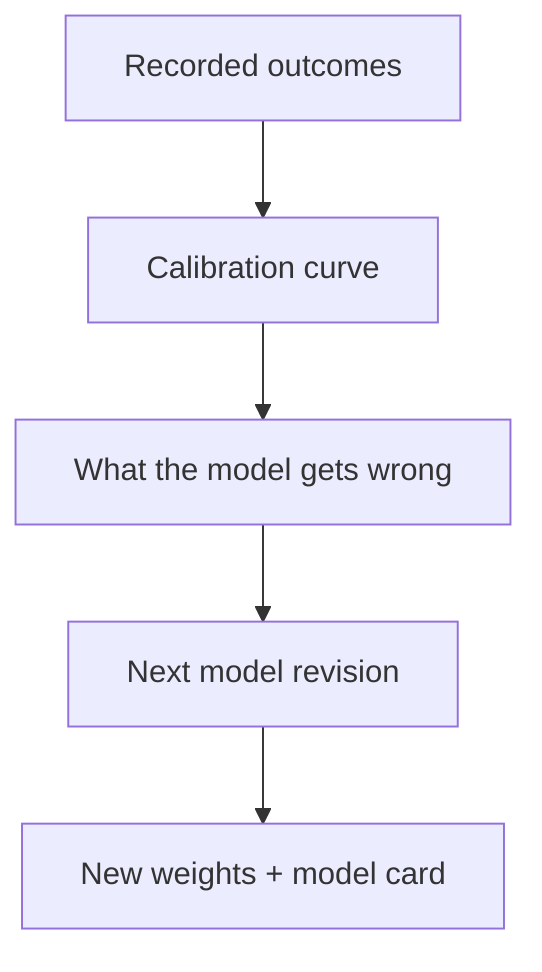

Nothing on this roadmap is implemented. It is written as outcomes so it can be
held to that standard.

---

## 🤝 Contributing

Read [CONTRIBUTING.md](CONTRIBUTING.md) first. The short version: three things
must remain true — every number on screen is computed, the UI/REST/MCP paths stay
shared, and fallback data never masquerades as live.

[](LICENSE)

---

<div align="center">
Made by <a href="https://github.com/aniruddhaadak80">aniruddhaadak80</a> ·
MIT licensed · no accounts, no keys, no lock-in
</div>